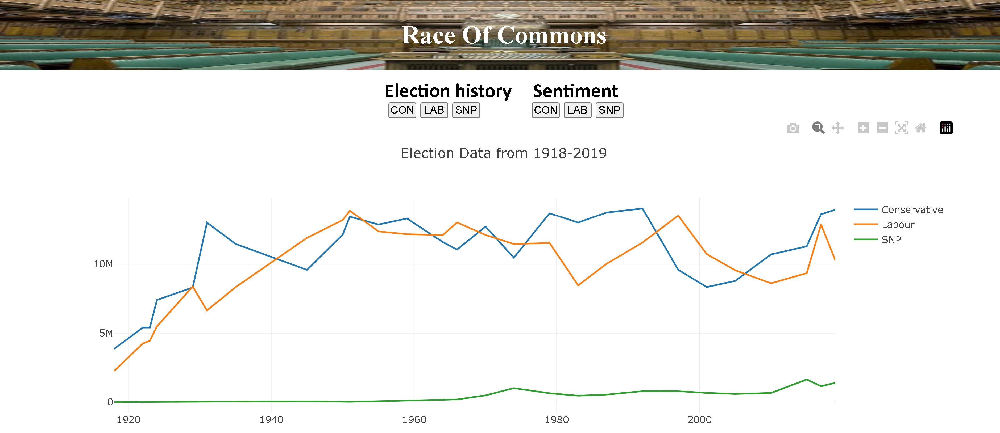

# UK Election Prediction
General Election history visualization tool, which is a single page web application hosted entirely on cloud.
Built using Amazon Web Services such as SageMaker, Lambda, DynamoDB in addition to TypeScript & plotly.js
# Hosted on AWS S3 bucket and is available: https://cst3130-00831005.s3.amazonaws.com/main.html

Project front-end screen shots

# TypeScript compilation - tsc file.ts (Automatically converts to JavaScript)
 File gets compiled to a javascript file then can be runned with node file.js or directly from the IDE

# Using watch: --watch to avoid compiling typeScript everytime you make changes
  tsc file.ts --watch (This will automatically update the js file with changes) 
